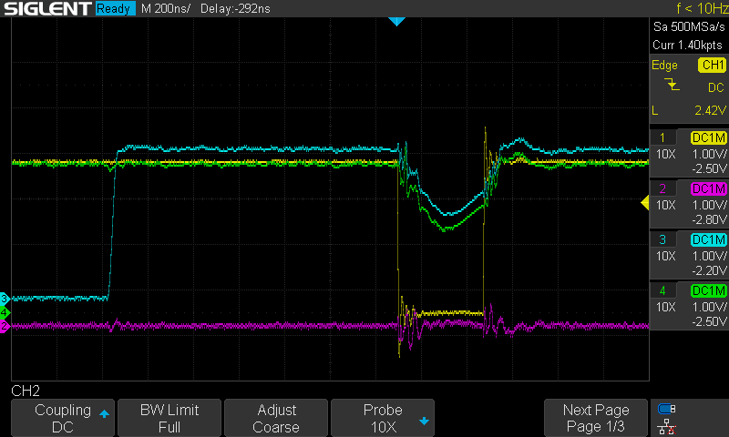
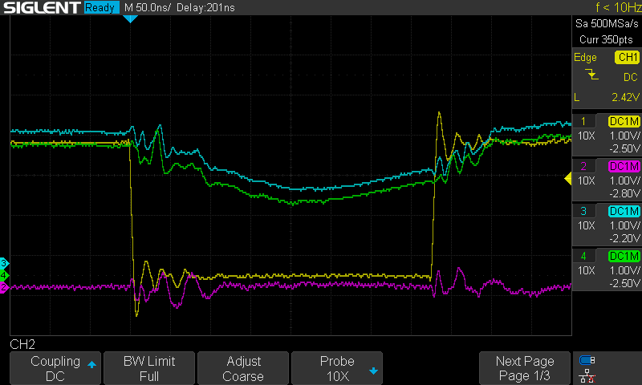

# PicoMax
A basic voltage glitcher built around the Raspberry Pi Pico and a MAX4619
switch IC.

# Building
If running on Arch install `pico-sdk` and logout-login for the environment
variables to be set.

```bash
cd src
mkdir build
cd build
cmake ..
make
```

After a successful build, you'll have the `picomax.uf2` file in the build
directory that can be flashed:
```bash
picotool load -F picomax.uf2 && picotool reboot
```

### Glitcher commands
I have tried to reduce the amount of commands necessary for an explorative
sweep to just one atomic command, but it didn't yield any actual speedup
compared to the separate `W`, `D` and `G` commands.

### Note for GCC13
Ensure this PR is merged: https://github.com/raspberrypi/pico-sdk/pull/1367

# Glitching
The glitcher is to be controlled with the `src/controller.py` script.

## Delay and width calculation
The delay and width are in Raspberry Pi Pico clock cycles. The Pico runs at
125MHz (save ring oscillator variability), thus delays can be varied by 8ns
increments.

With my specific MAX4619, switching time is ${\sim}10\ \text{ns}$ (quite close
to the limit of my oscilloscope, so take this with a grain of salt). The
shortest possible 5V-0V-5V cycle requires a rather underwhelming
${\sim}120\ \text{ns}$ (at 10 pico cycles). Each pico clock cycle takes
${\sim}8\ \text{ns}$, so the remaining ${\sim}40\ \text{ns}$ are taken by
hysteresis in the MAX4619. This gives us this ballpark formula for the delay:

$$\text{delay} = 20ns_{\text{pico switching}} + 40ns_{\text{MAX switching}} + \\#\text{cycles}\ \cdot\ 8ns_{\text{cycles}}$$

Same applies for the glitch width.

Given the above timings, it is more effective to switch between 5V and some
intermediate voltage that will not instantly trigger the brownout detector of
your target, but still achieve a succesful glitch.

## Succesful glitching setup
I have managed to glitch the program in `target_src` running on a PIC16LF1936
with the following setup:
```
power supply: 3.3V
glitch voltage: 1.40V
glitch delay: ~235 cycles
glitch width: ~35 cycles
```

Previously, I had managed to glitch a loop opearting on variables in registers
(see git history to find the old MPLAB project) with the following setup:
```
power supply: 3.3V
glitch voltage: 2.25V
glitch width: 20 cycles
```

I have found the glitch voltage playing around with the power supply knob until
I got ~20% brownout resets, then increased it a bit and tried with multiple
glitch widths until I got succesful glitches with this command

```bash
python3 controller.py -d 100 500 5 -w 10 50 2 -o
```

### Scope captures
In the captures below you can see a succesfull glitch of the variable in
register loop.
- Channel 1 (yellow) is the input to the A, B and C pins of the MAX4619
- Channel 2 (magenta) is the PIC pin that will be raised when the glitch fails
(event not shown here)
- Channel 3 (cyan) is the PIC pin that will be raised when the loop starts
- Channel 4 (green) is the power supply to the PIC




For additional information on the wiring see the `hardware` folder, and for
additional information on the code running on the PIC see the `target_src`
folder.
