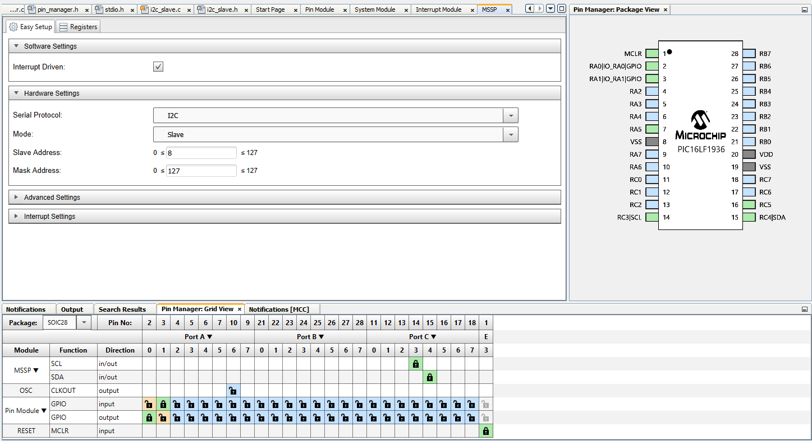

This folder contains a Microchip MPLAB project for the PIC16F1936 target. It
essentially performs a __program memory__ (flash) read after it receives a
single pulse from the glitcher. The value loaded from memory is stored in a
global variable, and the glitcher can then get it via an I2C read.

The PIC behaves as an I2C slave, and the glitcher as the master. I2C handling
is as barebones as it gets, borderline broken: it has been tested with one
single read per power cycle (don't @ me).

## Building
Just download and install MPLAB GUI plus the XC8 compiler. I have no clue how
to build this from the command line, nor I care to learn tbh.

The prebuilt .hex files flashable with pickle or any other PIC programmer can
be found in
`target_src/pic16_c_template_1.X/dist/HT_PIC16F1936/production/`

## CPU Configuration
- Brownout reset: enabled
- Clock speed: 16MHz

## PIC Port configuration
```
RA0: High during program memory read
RA1: Input with pulse from the glitcher to start the memory read
RC3: I2C clock
RC4: I2C data
```

